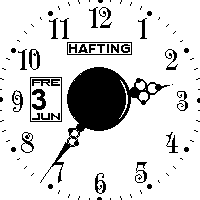
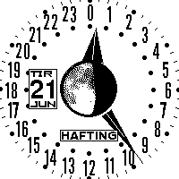
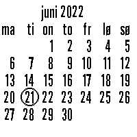

# Moon watch

A set of watch faces for the open-source E-Ink smartwatch [Watchy](https://watchy.sqfmi.com/).

## Features

- 12-hour watch with analog hands
- 24-hour watch with analog hands, useful for solar navigation
- Date, day, month and current zodiac sign
- Accurate moon phase, using NASA moon images. (2 per day)
- Calendar for current month and next month, including moon phase days
- step counter, alarms & timers from Watchy_GSR

Based on [Watchy_GSR](https://github.com/GuruSR/Watchy_GSR), some free fonts, and NASA moon images.

Clock hands are drawn using polar coordinates, a reasonably simple way of rotating them.

Text (day & month names) are in Norwegian, which needs characters outside of ascii. So I made a library for printing UTF-8 strings to make this possible. Any unicode characters in the basic multiligual plane are now printable on arduino, if backed by a suitable font and a bitmap display supported by Adafruit GFX. See [GFX-utf8](https://github.com/Hafting/gfx-utf8/)

The up and down menu keys are used to switch between watch displays (watch, calendar). 

Development was done with platformio on linux.

Future plans, if time permits:
- showing the next alarm in the watch display
- fetching events (calendar sync), creating alarms & more calendar displays
- step count display, buzz when reching the daily step goal

The other watch displays:

